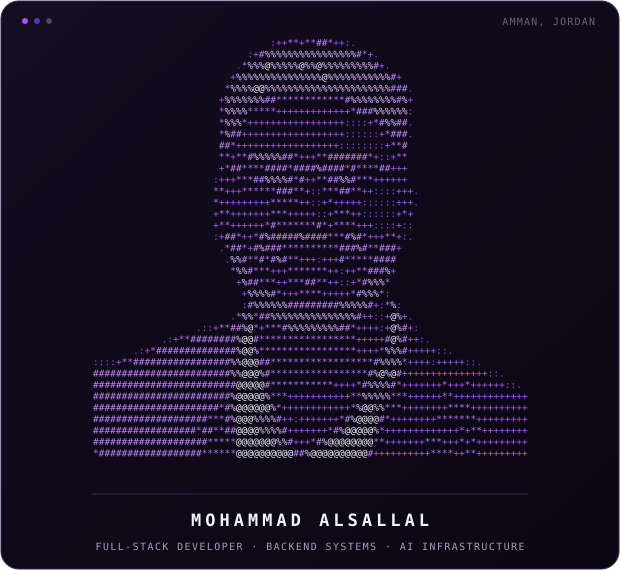
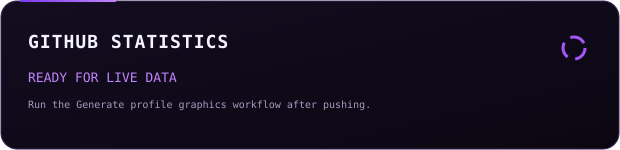
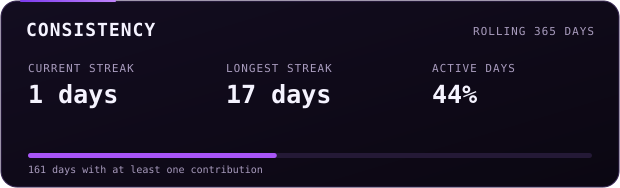
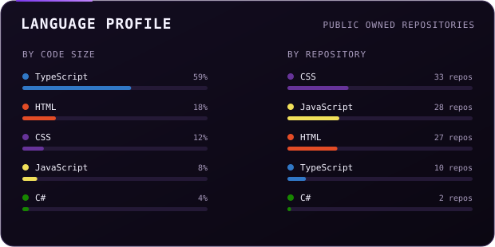
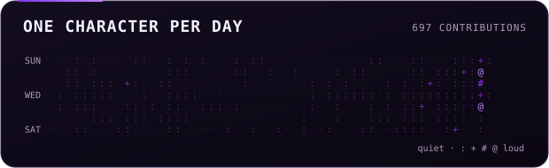

[portfolio](https://my-portfolio-nine-ruddy-81.vercel.app/) &nbsp;·&nbsp;
[linkedin](https://www.linkedin.com/in/mohammad-alsallal/) &nbsp;·&nbsp;
[github](https://github.com/mohasallal)

> Full-stack developer and Computer Science student based in Amman, Jordan. 
> I turn complex product requirements into maintainable systems.

I build TypeScript applications from interface to infrastructure: responsive 
frontends, backend APIs, authentication, data models, background processing, 
deployment pipelines, and the operational details that keep software reliable.

Right now, I am exploring production AI systems and how developers can use 
LLMs, retrieval, tools, and agent workflows without building every underlying 
piece of AI infrastructure themselves.

<samp>typescript &nbsp; next.js &nbsp; react &nbsp; node.js &nbsp; express &nbsp; nestjs &nbsp; tailwind 
postgresql &nbsp; drizzle &nbsp; mongodb &nbsp; redis &nbsp; docker &nbsp; cloudflare &nbsp; linux</samp>

**Managed AI Execution Platform** &nbsp;·&nbsp; <samp>typescript, llms, distributed systems</samp> 
An outcome-first execution layer that chooses models, retrieval, tools, and 
agent workflows inside developer-defined constraints.

**News and Content Platform** &nbsp;·&nbsp; <samp>next.js, express, drizzle, postgresql</samp> 
A production publishing system with structured content, secure sessions, 
role-based administration, media handling, and automated deployment.

**Distributed Application Platform** &nbsp;·&nbsp; <samp>nestjs, grpc, redis, docker</samp> 
An IAM, gateway, authorization, workspace, audit, and notification architecture 
using asymmetric JWTs, service communication, caching, and event-driven flows.

**Real-Time Event Registration** &nbsp;·&nbsp; <samp>typescript, socket.io, postgresql</samp> 
A staff-operated scheduling and registration system with conflict prevention, 
real-time dashboards, and activity-based capacity management.

**Consultant** at iTeam 
Former Team Lead, Web Section Leader, and R&amp;D Lead.

**Web Development Manager** at Badir wa Sahim 
Led web delivery and technical coordination for community-focused initiatives.

**Co-Founder and Business Development Manager** at MentoraJo 
Worked across product direction, partnerships, and business development.

Former Web Section Co-Lead at TEDx PHU, Vice Chair of the IEEE Computer 
Society, PR Officer and Backend Developer at TEDxDabouq, and PR Officer at ACM.

Every graphic on this page is generated inside this repository. The portrait 
above is a photograph decoded and averaged into a grid of characters, where the 
darker regions of the image become denser marks. The statistics come directly 
from the GitHub GraphQL API through a scheduled GitHub Action, then the 
resulting SVG files are committed back to the profile once per day.

Nothing loads from a third-party statistics service, so the profile does not 
depend on someone else's API limits or uptime. The generators are written in 
TypeScript and the visual system is defined in [`scripts/config.ts`](scripts/config.ts).

GitHub strips scripts and most custom styling from profile READMEs. Generating 
local SVG files provides a consistent visual identity while keeping the page 
fast, inspectable, and fully owned.
